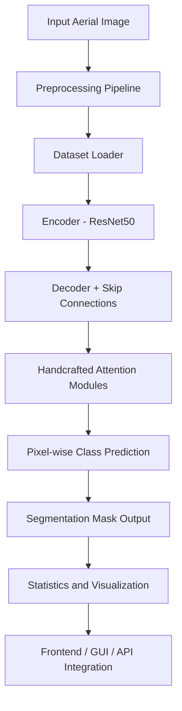

#  Oil Spill Semantic Segmentation System

An end-to-end deep learning system for **pixel-level semantic segmentation of oil spill phenomena** in aerial imagery using the **LADOS (Large-scale Aerial Dataset for Oil Spill Detection)** dataset.

The system detects and localizes multiple oil-related surface patterns in complex marine environments, supporting **environmental monitoring** and **maritime safety** applications.

---

## 1. Problem Statement

Manual inspection of aerial imagery for oil spill monitoring is time-consuming, expensive, and error-prone.  
This project automates the process by developing a **deep learning–based semantic segmentation system** capable of identifying oil-related classes at the pixel level, even in visually ambiguous marine scenes.

---

## 2. Dataset

**Dataset:** LADOS – Aerial Imagery Dataset for Oil Spill Detection  
**Task Type:** Multi-class Semantic Segmentation  

### Classes
- Background  
- Emulsion  
- Oil  
- Oil Platform  
- Sheen  
- Ship  

### Dataset Characteristics
- High intra-class variability  
- Strong class imbalance  
- Visual similarity between certain classes (e.g., Ship vs Oil Platform)

---

## 3. Preprocessing & Data Analysis

- Image resizing to **640 × 640** (aligned with LADOS research paper)
- Data augmentation using **Albumentations**:
  - Horizontal & vertical flips
  - Rotation & scaling
  - Brightness & contrast adjustment
  - Gaussian blur
- ImageNet normalization (required for pretrained backbones)
- Pixel-wise class distribution analysis
- Class weighting & weighted sampling to mitigate class imbalance

All preprocessing, analysis, and visualizations are implemented in the **preprocessing notebook**.

---

## 4. Model Architecture

### Encoder
- **ResNet50** pretrained on ImageNet
- Used strictly as a feature extraction backbone

### Decoder
- Custom decoder with skip connections
- Progressive upsampling using bilinear interpolation

### Handcrafted Attention Modules
Implemented from scratch to comply with course requirements:
- Channel Attention
- Spatial Attention

These modules improve feature discrimination in visually ambiguous regions.

### Output Layer
- 1×1 convolution for pixel-wise class prediction
- Output resolution matches input image size

---

## 5. Training Strategy

- **Loss Functions:**  
  - Cross Entropy Loss (with class weights)  
  - Dice Loss
- **Optimizer:** AdamW
- **Learning Rate Scheduler:** ReduceLROnPlateau
- **Early Stopping:** Based on validation mIoU
- **Evaluation Metric:** Mean Intersection over Union (mIoU)

---

## 6. Evaluation Results

- **Validation mIoU:** ~0.54  
- **Test mIoU:** ~0.56  

Per-class IoU is reported for detailed performance analysis.

---

## 7. System Architecture (Flow Overview)

The system follows a linear and modular architecture designed for clarity, scalability, and deployment readiness.



---

## 8. Design Principles

The system is designed following strict architectural and engineering principles to ensure robustness, reproducibility, and deployment readiness.

- **Separation of Concerns**  
  Clear separation between preprocessing, training, and inference stages to avoid pipeline coupling.

- **Offline Training**  
  Model training is fully offline and never triggered by the frontend or inference layer.

- **Inference-Ready Design**  
  The inference pipeline is modular and can be easily integrated into a GUI or exposed as an API service.

- **Reproducibility**  
  All experiments are fully reproducible using structured and version-controlled Jupyter notebooks.

---

## 9. Project Structure

The project is organized in a modular notebook-based structure reflecting the system pipeline stages.

```
notebooks/
├── 01_preprocessing_and_analysis.ipynb
├── 02_modeling_and_training.ipynb
└── 03_final_inference_and_visualization.ipynb
```

Each notebook corresponds to a distinct phase in the system lifecycle.

---

## 10. Team Contributions

Development was divided into specialized sub-teams to ensure parallel execution and clear ownership.

### Data Team (2 Members)
- Dataset preprocessing and cleaning
- Data augmentation pipeline design
- Class imbalance analysis and mitigation
- Dataset exploration and visualization

### Model Team (2 Members)
- Deep learning architecture design
- Handcrafted attention module implementation
- Training strategy definition
- Model evaluation and performance analysis

### Frontend Team (1 Member)
- User interface design
- Inference pipeline integration
- Visualization of segmentation outputs

---

## 11. How to Run

### Step 1: Install Dependencies
```bash
pip install -r requirements.txt
```

### Step 2: Execute Notebooks Sequentially
1. `01_preprocessing_and_analysis.ipynb`
2. `02_modeling_and_training.ipynb`
3. `03_final_inference_and_visualization.ipynb`

---

## 12. Future Improvements

Several extensions can be explored to further enhance system performance and applicability.

- Improve discrimination between visually similar classes
- Experiment with transformer-based or hybrid encoder architectures
- Deploy inference as a scalable backend API with a web-based frontend
- Extend the system toward panoptic segmentation

---

## License

MIT License
